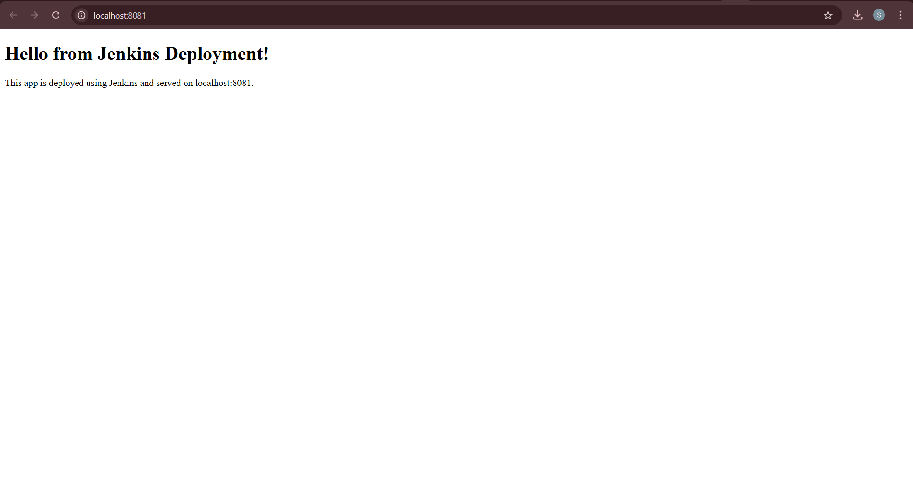
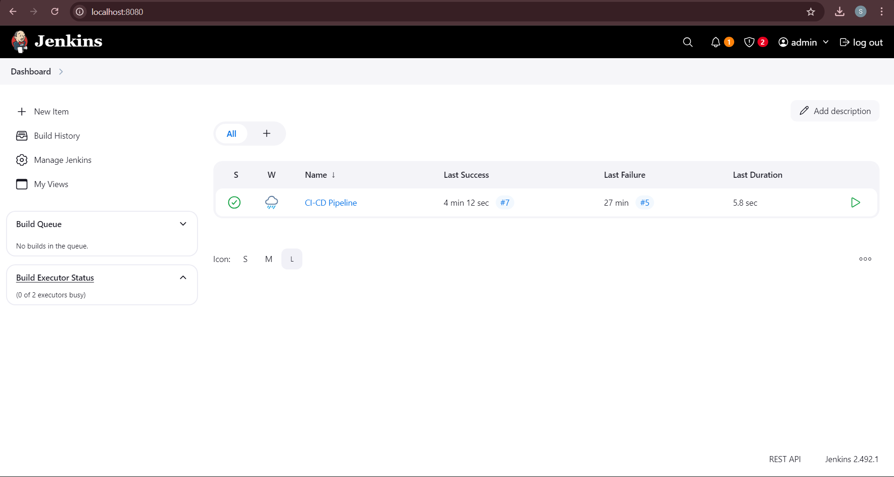
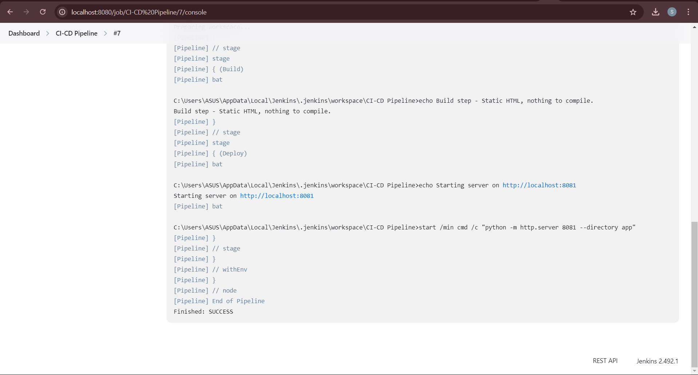
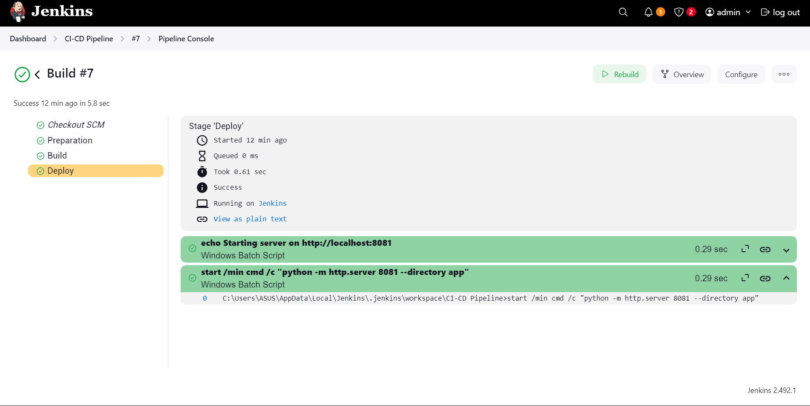
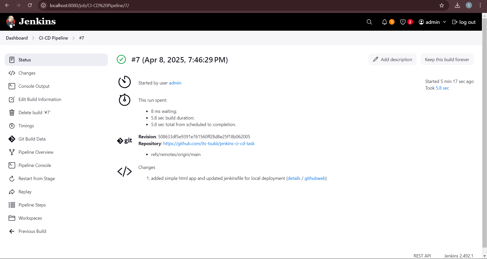
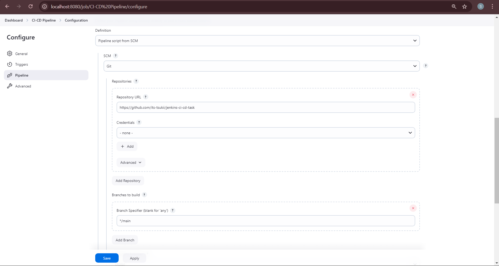

# 🚀 Jenkins CI/CD Pipeline

This project showcases a basic CI/CD pipeline setup using Jenkins and GitHub to build and deploy a simple HTML application.

---

## 📌 Task Objective

> Create a Jenkins pipeline that builds and deploys an application automatically when code is pushed to GitHub.

---

## 📁 Project Structure

jenkins-pipeline-task/ 
<br>│ ├── Jenkinsfile 
<br>│ ├── index.html 
<br>├── app/ 
<br>├── index.html 
<br>├── Dockerfile 
<br>├── Readme.md
<br>├── LICENSE
<br>└── screenshots/ 
<br>│ ├── app-running.png 
<br>│ ├── jenkins-config.png 
<br>│ ├── pipeline-success.png 
<br>│ ├── console-output.png

---

## 🖥️ App Running on Localhost

> This is the final deployed app running on `http://localhost:8081`.



---
## 🖥️ Jenkins Dashboard

> This is the Dashboard for the Jenkins App on windows on `http://localhost:8080`.



---
## 🖥️ Console_output of Jenkins

> This is the Output.



---
## 🖥️ Jenkins Pipeline Status

> This is the Pipeline Status for the Jenkins App on windows on `http://localhost:8080`.



---
## 🖥️ Jenkins Status

> This is the Status for the Jenkins App on windows on `http://localhost:8080`.



---

## 🔧 Jenkins Job Configuration

> GitHub integration and Script Path settings.



---

## ⚙️ Jenkinsfile Pipeline

A simple declarative Jenkins pipeline:
```
pipeline {
    agent any

    stages {
        stage('Build') {
            steps {
                bat 'echo Building the app...'
            }
        }

        stage('Deploy') {
            steps {
                bat 'start index.html'
            }
        }
    }
}
```
✅ Pipeline Success
A successful pipeline run from the Jenkins dashboard:


Console Output:


📚 How to Run Locally
bash
Copy
Edit
git clone https://github.com/yourusername/jenkins-ci-cd-task
cd jenkins-pipeline-task
start index.html
Make sure port 8081 is available if you're using a local server.

🔨 Tools & Tech Used
Jenkins

GitHub

HTML

Git (CLI)

Windows OS

🌐 Author
<br>Aayush Kukade
<br>GitHub • Medium
<br>https://medium.com/@sroy10012001
